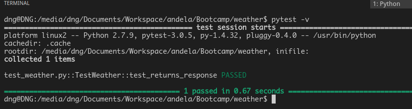
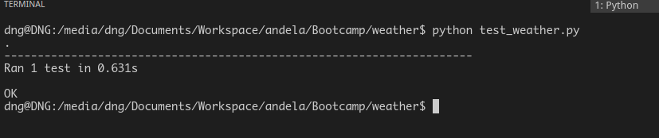
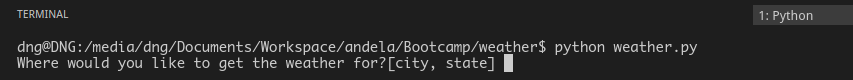
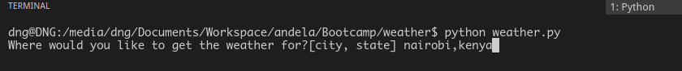
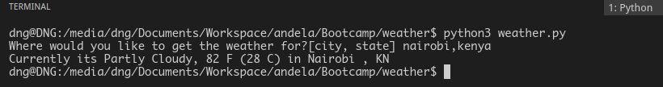
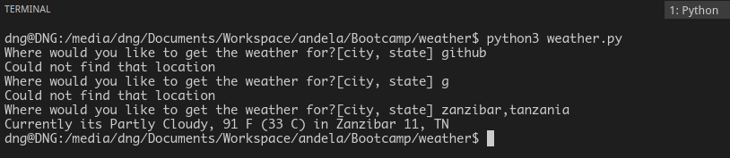

# WEATHER

This is a console application written using [python](https://www.python.org/) programming language.
The application consumes a public weather API from (link) using [request](http://docs.python-requests.org/en/master/),
a Http library for python.

## GETTING STARTED

On your terminal run the following command

`git clone https://github.com/andela-gathondu/Weather.git`

## PREREQUISITES

You should have python installed in your machine.
If you dont have python installed go to this link
    [Installing Python.](https://tutorial.djangogirls.org/en/python_installation/)

You should also have pytest installed for running the tests if not follow this link
[Installing pytest.](http://docs.pytest.org/en/latest/getting-started.html)


You should also have the requests library installed and if not [Install](http://docs.python-requests.org/en/master/user/install/)

## Running the test

1. Open your terminal and go to the directory where you have the project cloned.

2. On the terminal run this command `pytest -v` and you should notice that all defined tests pass and an output

   as follows should appear.

    

   You could also run the tests from your terminal using unittest using this command: `python test_weather.py`
   as I have included
   ```python
   if __name__ == "__main__":
    unittest.main()
    ```

    The output will be as follows:

     


3. To try out the program on the console, go to the terminal while still inside the project's folder and

   follow the process below.

    * type `python weather.py` on the and hit `enter` key and the following dialog will be displayed.
    

    * from there enter a location in the order of `city`,`state` as shown below:
    

    * If the location is found a result is displayed as shown below:

      

    * If the location is not found the message `Could not find that location`
      is displayed and program reruns until a valid locatin is given.

      


## Built With

* [visual studio code](https://code.visualstudio.com/)
* [python 3.6](https://www.python.org/downloads/)
* [requests](http://docs.python-requests.org/en/master/user/install/)